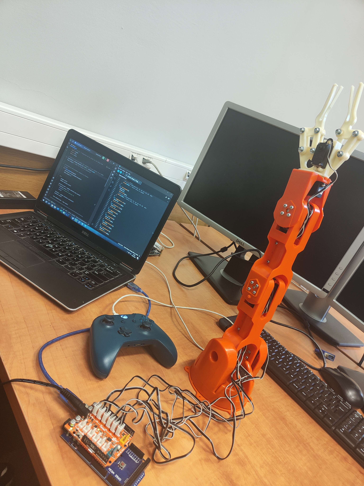
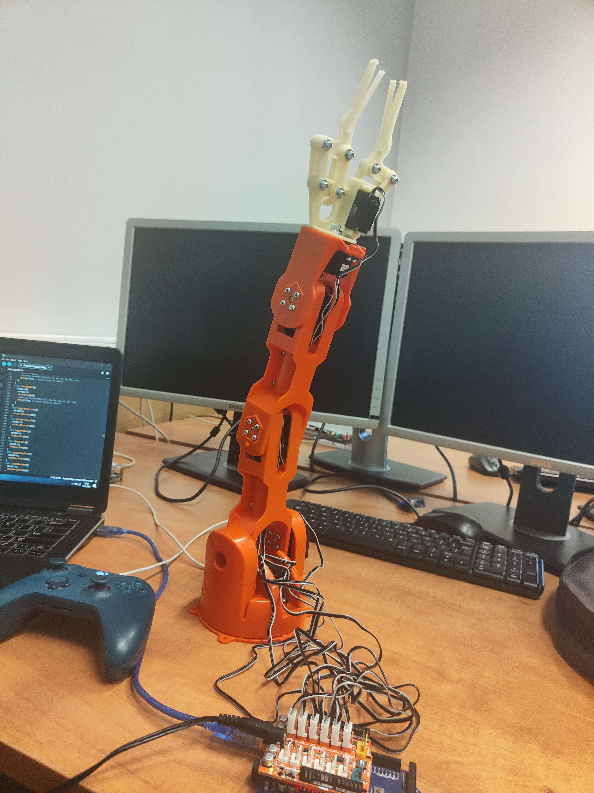

# Braccio_Robot_with_Python

## Project Overview

This project demonstrates the integration of the Braccio Robot Arm with a joystick controller, allowing users to intuitively control the movement of the robot arm. The control software is implemented in Python, leveraging the capabilities of the Pygame library for joystick input.

## Features

- **Joystick Control**: Use a joystick to control the movement of the Braccio Robot Arm.
- **Intuitive Interface**: The control interface is designed to be user-friendly, making it easy for both beginners and experienced users to operate the robot arm.

# Action presentation

   

 

# Photos

  
  
  

 
